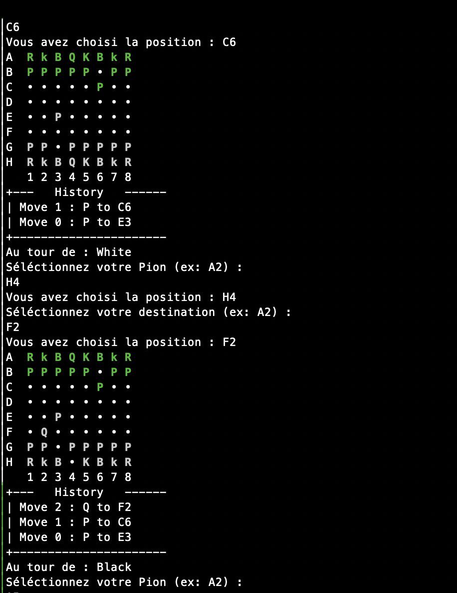

# Ech3c_Java

 
    Présentation :   

Bonjour et bienvenu sur notre github. 
Ce projet nous a été initié par l'IUT de Villetanneuse dans le cadre de nos études d'informatique.
Il s'agit d'un travail de groupe ayant pour but de confectionner et de créer un jeu d'échec en Java afin de développer nos compétances dans ce domaine.
Il nous permet de développer aussi des compétances annexes comme l'utilisation d'outils tels que github ou VSCode.

Voici un extrait de jeu :

*<small>selon la v0.0.1-beta</small>*

## Directories organisation

All the java source code of this game are in ``Ech3c_Java``directories. 

Here's the current UML diagram that we're using : 

    <b>Ech3c_Java </b>

___

<!-- Contact -->
 
    Contact : 

| Participants      | Email                         |
| -                 | -                             |
| Romain HEURTAUX   | heurtaux.romain@gmail.com     |
| Johann PAIMBOEUF  | /                             |
| JMLMathéo         | jmlmatheo-pro@outlook.com     |

---
